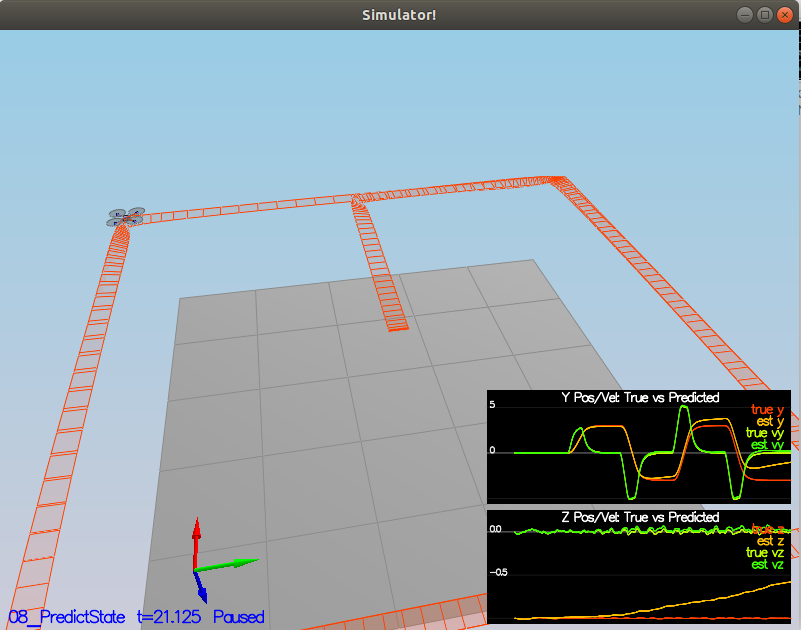
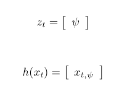
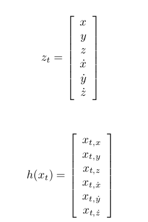
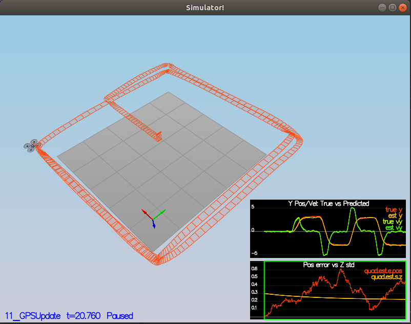

# Writeup

## Step 1 (Sensor Noise):
Calculate the standard deviation of `MeasuredStdDev_GPSPosXY` and `MeasuredStdDev_AccelXY`.

## Step 2 (Attitude Estimation):
Use a Non linear filter instead of the default linear one.
Using the equations from section 7.1.2 of [Estimation for Quadrotors](https://www.overleaf.com/read/vymfngphcccj):

Class `Math/Quaternion` is handy for this task.

Check function `UpdateFromIMU()`: [source code](./src/QuadEstimatorEKF.cpp#L74-L124)

## Step 3 (Prediction Step):
Implement the prediction step of the filter.

### 1. Implement the transition function.
Using the equation from section 7.2 of [Estimation for Quadrotors](https://www.overleaf.com/read/vymfngphcccj):

and knowing that the current state x_t is:

Check function `PredictState()`: [source code](./src/QuadEstimatorEKF.cpp#L149-L189)

### 2. Calculate partial derivative of body-to-global Rotation matrix:
Using the equation from section 7.2 of [Estimation for Quadrotors](https://www.overleaf.com/read/vymfngphcccj):

Check function `GetRbgPrime()`: [source code](./src/QuadEstimatorEKF.cpp#L191-L232)

### 3. Predict the state covariance forward:
Using the equation from section 7.2 of [Estimation for Quadrotors](https://www.overleaf.com/read/vymfngphcccj):

and the Predict function for EKF:

Check function `Predict()`: [source code](./src/QuadEstimatorEKF.cpp#L234-L284)

### 4. Tune parameters for covariance prediction:
Parameters to tune `QPosXYStd` and `QVelXYStd`.

## Step 4 (Magnetometer Update):
Add magnetometer information to improve filter's performance heading estimation.

### 1. Implement Magnetometer update function:
Using the equation from section 7.3.2 of [Estimation for Quadrotors](https://www.overleaf.com/read/vymfngphcccj):

Check function `UpdateFromMag()`: [source code](./src/QuadEstimatorEKF.cpp#L324-L356)

### 2. Tune Yaw parameter:
Parameter `QYawStd`.

## Step 5 (Closed Loop + GPS Update):

### 1. Implement GPS update function:
Using the equation from section 7.3.1 of [Estimation for Quadrotors](https://www.overleaf.com/read/vymfngphcccj):

Check function `UpdateFromGPS()`: [source code](./src/QuadEstimatorEKF.cpp#L286-L322)

